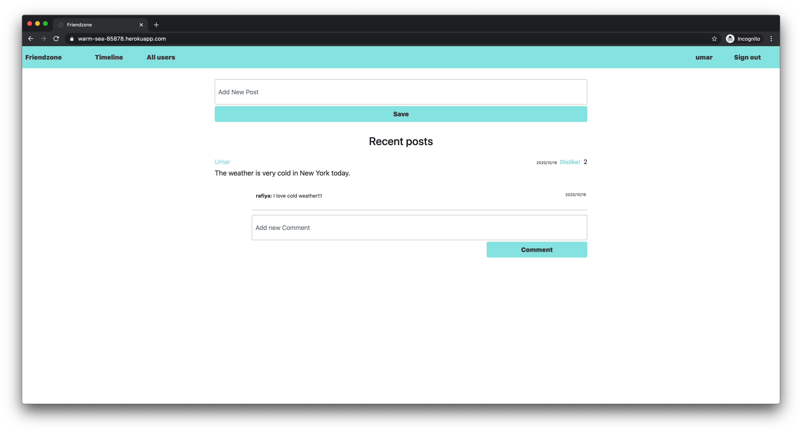

# Social Media App

> A Social Media app with friendships and like features.



## Built With

- Ruby v2.7.1
- Ruby on Rails
- Bootstrap
- RSpec
- Sass

## Features

### As a Guest User:

* I want to be able to create account/log in.
* I can see only “Sign in” and “Sign out” page.

### As a Logged-in User:

* I want to be able to see all users list.
* I want to be able to see selected user page with their user name and all posts written by them (the most recent posts on the top).
* I want to be able to send a friendship invitation.
* I want to see a button “Invite to friendship” next to the name of user who is not my friend yet - on both users’ list and single user page.
* I want to be able to see pending friendship invitations sent to me from other users.
* I want to be able to accept or reject friendships invitation.
* I want to be able to create new posts (text only).
* I want to be able to like/dislike posts (but I can like single post only once).
* I want to be able to add comments to posts.
* I want to be able to see “Timeline” page with posts (with number of likes and comments) written by me and all my friends (the most recent posts on the top).
Timeline page should be the root page of the app.

## Live Demo

- [Live link](https://warm-sea-85878.herokuapp.com/)

## Getting Started

To get a local copy up and running follow these simple example steps.

### Prerequisites

- Ruby: 2.7.1
- Rails: 5.2.4
- Postgres: >=9.5

### Setup

Instal gems with:

```
bundle install
```

Setup database with:

```
   rails db:create
   rails db:migrate
```

### Usage

Start server with:

```
    rails server
```

Open `http://localhost:3000/` in your browser.

### Run tests

```
    rpsec
```

### Deployment

- Heroku

## Authors

**Muhammad Umar**
- Github: [@mohammadumar28](https://github.com/mohammadumar28)
- LinkedIn: [Mohammad Umar](https://www.linkedin.com/in/mohammadumar28/)
- Twitter: [@Mohammadumar28](https://twitter.com/Mohammadumar28)
- Email: [mohammadumar28@gmail.com](mailto:mohammadumar28@gmail.com)

**Aldana Longhi**
- Github: [@AlduLonghi](https://github.com/AlduLonghi)
- Linkedin: [Aldana Abril Longhi](https://www.linkedin.com/in/aldana-abril-longhi-a842ba1a7/)
- Twitter: [@AbrilLonghi](https://twitter.com/AbrilLonghi)
- Email [aldulonghi@gmail.com](mailto:aldulonghi@gmail.com)

## Acknowledgements

* [Microverse](https://microverse.org)

## Contribution

* Fork this repo.
* Create your feature branch `git checkout -b my-new-feature`.
* Commit your changes `git commit -am "Add some feature"`.
* Push to the branch `git push origin my-new-feature`.
* Create a new Pull Request.
